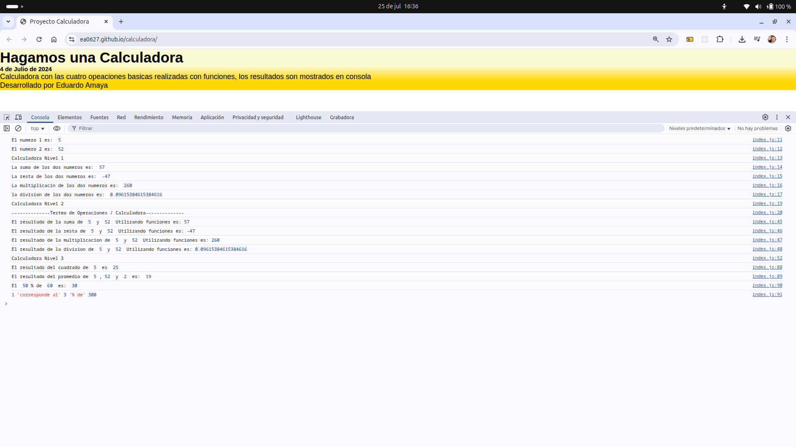

# 🧮 Calculadora

Este proyecto es una calculadora funcional que permite realizar operaciones aritméticas básicas como suma, resta, multiplicación y división. Fue desarrollada con HTML, CSS y JavaScript, aplicando lógica de programación y eventos del DOM para responder a las acciones del usuario.

---

## 🔗 Vista en vivo

👉 [Ver calculadora en GitHub Pages](https://ea0627.github.io/calculadora)

---

## ⚙️ Funcionalidades implementadas

- ➕➖✖️➗ Realiza operaciones básicas (suma, resta, multiplicación y división).
- 🧼 Botón para limpiar la pantalla.
- ✅ Validación de errores básicos (como división por cero).
- 📱 Diseño responsivo para uso en móviles y escritorio.

---

## 🛠️ Tecnologías usadas

- HTML5
- CSS3
- JavaScript (ES6)
- Git + GitHub Pages

---

## 📁 Estructura del Proyecto

```
calculadora/
├── assets/              # Imágenes si las hay
├── css/
│   └── style.css
├── js/
│   └── script.js
├── index.html
└── README.md
```

---

## 📸 Captura de pantalla



---

## 👨‍💻 Autor

**Eduardo Amaya**  
Desarrollador Web Junior  
Bootcamp TripleTen  

📬 eduardo.amaya627@gmail.com  
🔗 [GitHub @ea0627](https://github.com/ea0627)

---

## 📌 Notas adicionales

- Proyecto desarrollado como práctica de eventos, condicionales y estructuras básicas en JavaScript.
- Puede ampliarse para incluir teclas del teclado, operaciones avanzadas o modo oscuro.

---

> ¡Gracias por probar esta calculadora! Sigue navegando por mis proyectos para más lógica y funcionalidad. 🧠🔢
